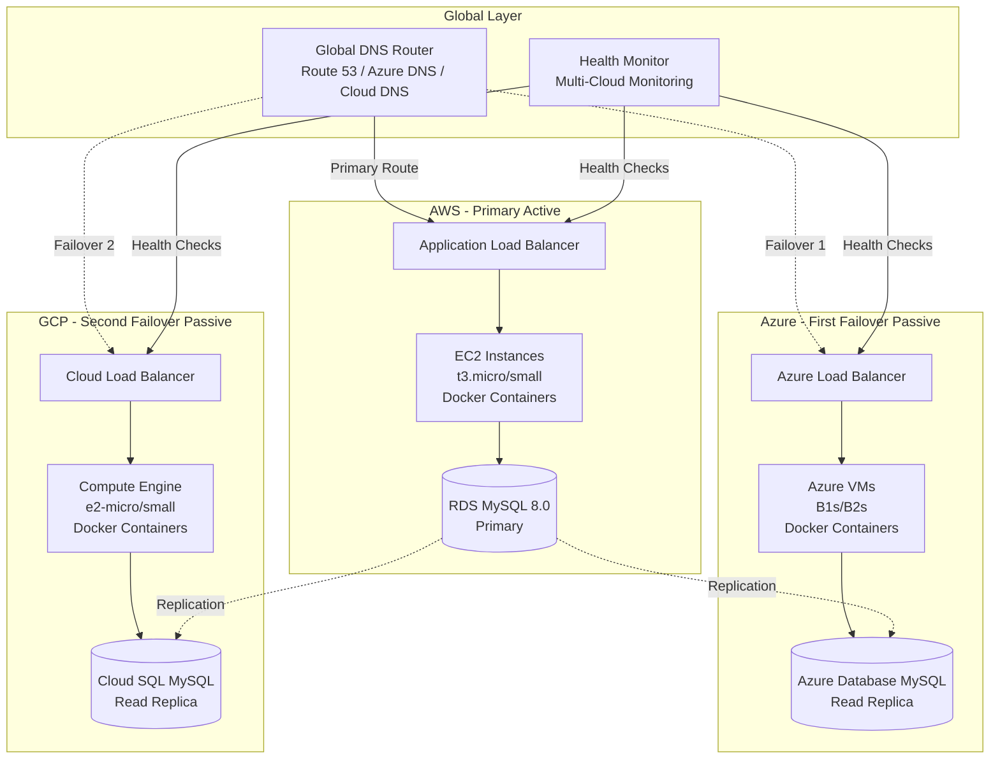

# Design Document: Multi-Cloud Disaster Recovery System

## Overview

The Multi-Cloud Disaster Recovery System provides high availability and business continuity for the Singha Loyalty System through an active-passive-passive architecture spanning AWS, Azure, and Google Cloud Platform. The design prioritizes cost optimization while maintaining sub-5-minute RTO and sub-5-second RPO objectives.

The system uses DNS-based global traffic routing with automated health monitoring to detect failures and orchestrate failover sequences. Database replication ensures data consistency across all clouds, while comprehensive security controls protect the application and data at all layers.

### Design Principles

1. **Cost-First Architecture**: Active-passive-passive configuration minimizes costs while maintaining DR capabilities
2. **Cloud-Agnostic Design**: Use equivalent services across clouds to maintain architectural consistency
3. **Automation-First**: Automated failover, monitoring, and recovery reduce manual intervention
4. **Security by Design**: Defense-in-depth with encryption, network isolation, and least privilege access
5. **Observable Systems**: Comprehensive monitoring and logging enable rapid issue detection and resolution

## Architecture

### High-Level Architecture

The system consists of three identical application stacks deployed across AWS (primary), Azure (first failover), and GCP (second failover). A global DNS routing layer directs traffic to the healthy active cloud based on continuous health monitoring.



### Traffic Flow States

**Normal Operation (AWS Active)**:
1. User requests → Global DNS → AWS Load Balancer
2. AWS Load Balancer → AWS EC2 Instances (Frontend + Backend)
3. AWS Application → AWS RDS MySQL (Primary)
4. AWS RDS → Continuous replication → Azure Database + Cloud SQL

**Failover State 1 (Azure Active)**:
1. Health Monitor detects AWS failure
2. DNS updates to point to Azure (60 seconds)
3. User requests → Global DNS → Azure Load Balancer
4. Azure Load Balancer → Azure VMs (Frontend + Backend)
5. Azure Application → Azure Database MySQL (promoted to primary)
6. Azure Database → Replication to GCP continues

**Failover State 2 (GCP Active)**:
1. Health Monitor detects AWS and Azure failures
2. DNS updates to point to GCP (60 seconds)
3. User requests → Global DNS → GCP Load Balancer
4. GCP Load Balancer → Compute Engine instances
5. GCP Application → Cloud SQL MySQL (promoted to primary)

## Components and Interfaces

### 1. DNS Router Component

**Responsibility**: Global traffic routing with health-based failover

**AWS Implementation**: Amazon Route 53
- Health checks with 30-second intervals
- Failover routing policy
- TTL: 60 seconds for rapid failover

**Azure Implementation**: Azure Traffic Manager
- Endpoint monitoring with 30-second intervals
- Priority routing method
- DNS TTL: 60 seconds

**GCP Implementation**: Cloud DNS with Cloud Load Balancing
- Health checks with 30-second intervals
- Failover configuration
- TTL: 60 seconds

**Interface**:
```typescript
interface DNSRouter {
  // Configure health check for an endpoint
  configureHealthCheck(endpoint: Endpoint, interval: number): HealthCheck;
  
  // Update DNS records for failover
  updateDNSRecords(activeCloud: CloudProvider): Promise<void>;
  
  // Get current active endpoint
  getActiveEndpoint(): Endpoint;
}

interface Endpoint {
  cloudProvider: 'AWS' | 'Azure' | 'GCP';
  url: string;
  priority: number;
  healthStatus: 'healthy' | 'unhealthy';
}
```

### 2. Health Monitor Component

**Responsibility**: Continuous health monitoring and failure detection

**Implementation**: Multi-cloud monitoring using native services
- AWS: CloudWatch + Lambda for health checks
- Azure: Azure Monitor + Application Insights
- GCP: Cloud Monitoring + Cloud Functions

**Health Check Types**:
1. HTTP/HTTPS endpoint checks (application availability)
2. Database connectivity checks (replication lag)
3. Resource utilization checks (CPU, memory, disk)

**Interface**:
```typescript
interface HealthMonitor {
  // Perform health check on endpoint
  checkHealth(endpoint: Endpoint): Promise<HealthStatus>;
  
  // Get replication lag for database
  getReplicationLag(database: DatabaseEndpoint): Promise<number>;
  
  // Send alert when health check fails
  sendAlert(alert: Alert): Promise<void>;
}

interface HealthStatus {
  endpoint: Endpoint;
  status: 'healthy' | 'unhealthy';
  responseTime: number;
  timestamp: Date;
  consecutiveFailures: number;
}

interface Alert {
  severity: 'critical' | 'warning' | 'info';
  message: string;
  affectedComponent: string;
  timestamp: Date;
}
```

### 3. Failover Orchestrator Component

**Responsibility**: Automated failover sequence management

**Implementation**: Event-driven architecture using cloud-native services
- AWS: EventBridge + Step Functions
- Azure: Event Grid + Logic Apps
- GCP: Eventarc + Cloud Workflows

**Failover Sequence**:
1. Detect failure (3 consecutive failed health checks)
2. Verify secondary cloud health
3. Promote secondary database to primary
4. Update DNS records
5. Send notifications
6. Log failover event

**Interface**:
```typescript
interface FailoverOrchestrator {
  // Initiate failover to target cloud
  initiateFailover(targetCloud: CloudProvider): Promise<FailoverResult>;
  
  // Verify failover completion
  verifyFailover(targetCloud: CloudProvider): Promise<boolean>;
  
  // Rollback failover if issues detected
  rollbackFailover(): Promise<void>;
}

interface FailoverResult {
  success: boolean;
  targetCloud: CloudProvider;
  duration: number;
  timestamp: Date;
  errors?: string[];
}
```

### 4. Database Replicator Component

**Responsibility**: MySQL replication and data consistency

**Replication Strategy**: Primary-to-replica asynchronous replication

**AWS RDS MySQL Configuration**:
- Multi-AZ deployment for local HA
- Binary log replication enabled
- Automated backups with 30-day retention
- Point-in-time recovery enabled

**Azure Database for MySQL Configuration**:
- Read replica from AWS RDS
- Geo-redundant backup enabled
- Replication lag monitoring

**Cloud SQL MySQL Configuration**:
- Read replica from AWS RDS
- Automated backups enabled
- Replication lag monitoring

**Cross-Cloud Replication**:
- Use native replication features where available
- Fallback to binary log replication over VPN
- Monitor replication lag (target: <5 seconds)

**Interface**:
```typescript
interface DatabaseReplicator {
  // Configure replication from primary to replica
  configureReplication(primary: Database, replica: Database): Promise<void>;
  
  // Get current replication lag
  getReplicationLag(replica: Database): Promise<number>;
  
  // Promote replica to primary
  promoteReplica(replica: Database): Promise<void>;
  
  // Verify data consistency
  verifyConsistency(databases: Database[]): Promise<ConsistencyReport>;
}

interface Database {
  cloudProvider: CloudProvider;
  endpoint: string;
  port: number;
  role: 'primary' | 'replica';
}

interface ConsistencyReport {
  consistent: boolean;
  lastChecked: Date;
  discrepancies?: string[];
}
```

### 5. Security Manager Component

**Responsibility**: Security controls across all clouds

**IAM/RBAC Configuration**:
- AWS: IAM roles with least privilege policies
- Azure: Azure AD with RBAC assignments
- GCP: Service accounts with IAM bindings

**Secrets Management**:
- AWS: AWS Secrets Manager
- Azure: Azure Key Vault
- GCP: Secret Manager

**Network Security**:
- Private subnets for application and database tiers
- Security groups/firewall rules for traffic control
- VPN or private connectivity between clouds

**Interface**:
```typescript
interface SecurityManager {
  // Store secret in cloud-native secret manager
  storeSecret(key: string, value: string, cloud: CloudProvider): Promise<void>;
  
  // Retrieve secret from secret manager
  getSecret(key: string, cloud: CloudProvider): Promise<string>;
  
  // Rotate credentials
  rotateCredentials(resourceType: string): Promise<void>;
  
  // Configure network security rules
  configureNetworkSecurity(rules: SecurityRule[]): Promise<void>;
}

interface SecurityRule {
  source: string;
  destination: string;
  port: number;
  protocol: 'TCP' | 'UDP';
  action: 'allow' | 'deny';
}
```

### 6. Cost Monitor Component

**Responsibility**: Cost tracking and optimization

**Implementation**:
- AWS: Cost Explorer API + Budgets
- Azure: Cost Management API
- GCP: Cloud Billing API

**Cost Tracking**:
- Daily cost aggregation per cloud
- Monthly cost reports
- Budget alerts at 80% and 100% thresholds

**Interface**:
```typescript
interface CostMonitor {
  // Get current month costs for a cloud
  getCurrentCosts(cloud: CloudProvider): Promise<CostReport>;
  
  // Set budget alert threshold
  setBudgetAlert(cloud: CloudProvider, threshold: number): Promise<void>;
  
  // Get cost forecast
  getForecast(cloud: CloudProvider, days: number): Promise<number>;
}

interface CostReport {
  cloudProvider: CloudProvider;
  period: string;
  totalCost: number;
  breakdown: CostBreakdown[];
}

interface CostBreakdown {
  service: string;
  cost: number;
  percentage: number;
}
```

## Data Models

### Cloud Configuration Model

```typescript
interface CloudConfiguration {
  provider: CloudProvider;
  region: string;
  priority: number; // 1=primary, 2=first failover, 3=second failover
  compute: ComputeConfig;
  database: DatabaseConfig;
  networking: NetworkConfig;
  monitoring: MonitoringConfig;
}

interface ComputeConfig {
  instanceType: string;
  instanceCount: number;
  containerImage: string;
  autoScaling: AutoScalingConfig;
}

interface DatabaseConfig {
  instanceClass: string;
  engine: 'MySQL';
  version: '8.0';
  storage: number; // GB
  backupRetention: number; // days
  multiAZ: boolean;
}

interface NetworkConfig {
  vpcCIDR: string;
  publicSubnets: string[];
  privateSubnets: string[];
  securityGroups: SecurityGroup[];
}

interface MonitoringConfig {
  healthCheckInterval: number; // seconds
  healthCheckTimeout: number; // seconds
  healthCheckThreshold: number; // consecutive failures
  alertEndpoints: string[];
}

interface AutoScalingConfig {
  minInstances: number;
  maxInstances: number;
  targetCPU: number; // percentage
}

interface SecurityGroup {
  name: string;
  rules: SecurityRule[];
}

type CloudProvider = 'AWS' | 'Azure' | 'GCP';
```

### Failover Event Model

```typescript
interface FailoverEvent {
  id: string;
  timestamp: Date;
  sourceCloud: CloudProvider;
  targetCloud: CloudProvider;
  trigger: FailoverTrigger;
  status: FailoverStatus;
  duration: number; // seconds
  steps: FailoverStep[];
}

interface FailoverTrigger {
  type: 'health_check_failure' | 'manual' | 'scheduled_test';
  reason: string;
  consecutiveFailures?: number;
}

interface FailoverStep {
  name: string;
  status: 'pending' | 'in_progress' | 'completed' | 'failed';
  startTime: Date;
  endTime?: Date;
  error?: string;
}

type FailoverStatus = 
  | 'initiated' 
  | 'promoting_database' 
  | 'updating_dns' 
  | 'verifying' 
  | 'completed' 
  | 'failed' 
  | 'rolled_back';
```

### Service Mapping Model

```typescript
interface ServiceMapping {
  category: ServiceCategory;
  aws: AWSService;
  azure: AzureService;
  gcp: GCPService;
  notes: string;
}

type ServiceCategory = 
  | 'compute' 
  | 'database' 
  | 'networking' 
  | 'dns' 
  | 'load_balancer' 
  | 'monitoring' 
  | 'secrets' 
  | 'storage';

interface AWSService {
  name: string;
  tier: string; // e.g., "t3.micro", "db.t3.micro"
  estimatedMonthlyCost: number;
}

interface AzureService {
  name: string;
  tier: string; // e.g., "B1s", "Basic"
  estimatedMonthlyCost: number;
}

interface GCPService {
  name: string;
  tier: string; // e.g., "e2-micro", "db-f1-micro"
  estimatedMonthlyCost: number;
}
```

## Service Mapping Table

| Category | AWS | Azure | GCP | Notes |
|----------|-----|-------|-----|-------|
| **Compute** | EC2 (t3.micro/small) | Azure VMs (B1s/B2s) | Compute Engine (e2-micro/small) | Docker containers on all |
| **Database** | RDS MySQL 8.0 (db.t3.micro) | Azure Database for MySQL (Basic) | Cloud SQL MySQL (db-f1-micro) | Managed MySQL services |
| **Load Balancer** | Application Load Balancer | Azure Load Balancer | Cloud Load Balancing | Layer 7 HTTP/HTTPS |
| **DNS** | Route 53 | Azure DNS / Traffic Manager | Cloud DNS | Health-based routing |
| **VPC/Network** | VPC | Virtual Network (VNet) | VPC | Private networking |
| **Secrets** | Secrets Manager | Key Vault | Secret Manager | Encrypted secret storage |
| **Monitoring** | CloudWatch | Azure Monitor | Cloud Monitoring | Metrics and logs |
| **Storage** | S3 | Blob Storage | Cloud Storage | Object storage for backups |
| **IAM** | IAM | Azure AD + RBAC | IAM | Identity and access |
| **Firewall** | Security Groups | Network Security Groups | Firewall Rules | Network security |

## Cost Estimation

### Monthly Cost Breakdown (USD)

**AWS (Primary - Active)**:
- EC2 t3.micro (2 instances): $15/month
- RDS MySQL db.t3.micro: $25/month
- Application Load Balancer: $20/month
- Data transfer: $10/month
- Route 53: $1/month
- CloudWatch: $5/month
- **Total AWS: ~$76/month**

**Azure (First Failover - Passive)**:
- Azure VMs B1s (2 instances): $15/month
- Azure Database for MySQL Basic: $25/month
- Azure Load Balancer: $20/month
- Data transfer: $5/month (minimal, passive)
- Azure Monitor: $5/month
- **Total Azure: ~$70/month**

**GCP (Second Failover - Passive)**:
- Compute Engine e2-micro (2 instances): $12/month
- Cloud SQL db-f1-micro: $20/month
- Cloud Load Balancing: $18/month
- Data transfer: $5/month (minimal, passive)
- Cloud Monitoring: $5/month
- **Total GCP: ~$60/month**

**Grand Total: ~$206/month** for complete multi-cloud DR system

**Cost Optimization Strategies**:
1. Use free tier resources during development/testing
2. Active-passive-passive reduces compute costs on standby clouds
3. Reserved instances for 1-year commitment (30% savings)
4. Automated shutdown of non-production environments
5. Right-sizing based on actual usage metrics


## Correctness Properties

A property is a characteristic or behavior that should hold true across all valid executions of a system—essentially, a formal statement about what the system should do. Properties serve as the bridge between human-readable specifications and machine-verifiable correctness guarantees.

### Property 1: Multi-Cloud Deployment Consistency

*For any* cloud provider in the set {AWS, Azure, GCP}, when the DR system is deployed, all required infrastructure components (compute, database, networking, load balancer) should exist and be properly configured.

**Validates: Requirements 1.1, 1.2, 1.3**

### Property 2: Container Image Consistency

*For any* cloud deployment, all compute resources should be configured to run the same Docker container image with the same version tag.

**Validates: Requirements 1.4, 1.5**

### Property 3: DNS Routing to Healthy Primary

*For any* time when the Primary_Cloud health checks are passing, DNS queries should resolve to the Primary_Cloud endpoint.

**Validates: Requirements 2.1**

### Property 4: Failover Cascade

*For any* sequence of cloud failures, the DNS_Router should route traffic to the highest-priority healthy cloud (AWS → Azure → GCP priority order).

**Validates: Requirements 2.2, 2.3**

### Property 5: Health Check Frequency

*For any* 60-second time window, the Health_Monitor should perform at least 2 application health checks on each cloud endpoint.

**Validates: Requirements 2.4**

### Property 6: DNS Update Timeliness

*For any* failover event, the time from failover initiation to DNS record update should not exceed 60 seconds.

**Validates: Requirements 2.5**

### Property 7: RTO Compliance

*For any* failover event, the total time from failure detection to successful traffic routing to the failover cloud should not exceed 5 minutes.

**Validates: Requirements 2.7**

### Property 8: Replication Lag Bounds

*For any* database write operation on the primary, the data should appear in all replica databases within 5 seconds.

**Validates: Requirements 3.1, 3.2**

### Property 9: Database Promotion Timeliness

*For any* failover event requiring database promotion, the replica database should be promoted to primary role within 2 minutes.

**Validates: Requirements 3.4**

### Property 10: RPO Compliance

*For any* simulated failure scenario, the maximum data loss (measured in time) should not exceed 5 seconds.

**Validates: Requirements 3.5**

### Property 11: Consistency Verification

*For any* 5-minute time window, the Database_Replicator should perform at least one consistency check across all database replicas.

**Validates: Requirements 3.6**

### Property 12: Inconsistency Alerting

*For any* detected data inconsistency, an alert should be sent to administrators and the discrepancy should be logged within 30 seconds.

**Validates: Requirements 3.7**

### Property 13: Least Privilege IAM

*For any* IAM role or service account, the attached policies should grant only the minimum permissions required for the component's function.

**Validates: Requirements 4.1**

### Property 14: Secret Storage Security

*For any* secret (database password, JWT key, API token), it should be stored in the cloud-native secret management service and not in plaintext configuration files.

**Validates: Requirements 4.2**

### Property 15: TLS Version Enforcement

*For any* network connection between system components, the TLS version should be 1.2 or higher.

**Validates: Requirements 4.4**

### Property 16: Firewall Rule Minimalism

*For any* security group or firewall rule, only explicitly required ports and protocols should be allowed, with all other traffic denied by default.

**Validates: Requirements 4.6**

### Property 17: Database Authentication

*For any* database connection attempt, authentication using managed identities or service accounts should be required.

**Validates: Requirements 4.7**

### Property 18: Credential Rotation

*For any* database credential, it should be rotated within 90 days of the last rotation.

**Validates: Requirements 4.8**

### Property 19: Per-Cloud Cost Tracking

*For any* cloud provider, the Cost_Monitor should maintain separate cost tracking data that can be queried independently.

**Validates: Requirements 5.1**

### Property 20: Cost Report Generation

*For any* completed calendar month, the Cost_Monitor should generate a cost report comparing actual vs. estimated costs for each cloud.

**Validates: Requirements 5.2**

### Property 21: Budget Alert Threshold

*For any* month where costs exceed the budget threshold by 20%, an alert should be sent to administrators.

**Validates: Requirements 5.3**

### Property 22: Cost Estimation Availability

*For any* cloud provider, cost estimates should be calculable and available before deployment begins.

**Validates: Requirements 5.6**

### Property 23: Resource Utilization Reporting

*For any* 7-day period, the Cost_Monitor should generate at least one report identifying unused or underutilized resources.

**Validates: Requirements 5.7**

### Property 24: Application Health Check Frequency

*For any* 60-second time window, the Health_Monitor should perform at least 2 health checks on each application endpoint.

**Validates: Requirements 6.1**

### Property 25: Database Health Check Frequency

*For any* 120-second time window, the Health_Monitor should perform at least 2 database connectivity and replication lag checks.

**Validates: Requirements 6.2**

### Property 26: Failure Detection Threshold

*For any* endpoint that fails 3 consecutive health checks, the Health_Monitor should mark it as unhealthy.

**Validates: Requirements 6.3**

### Property 27: Unhealthy Component Alerting

*For any* component marked as unhealthy, alerts should be sent via configured channels (email, SMS) within 60 seconds.

**Validates: Requirements 6.4**

### Property 28: Centralized Log Collection

*For any* log entry generated on any cloud, it should appear in the centralized logging system within 5 minutes.

**Validates: Requirements 6.5**

### Property 29: Log Retention Period

*For any* log entry, it should be retained for at least 90 days before being eligible for deletion.

**Validates: Requirements 6.6**

### Property 30: Metrics Tracking Completeness

*For any* application endpoint, the Health_Monitor should track and report response time, error rate, and availability metrics.

**Validates: Requirements 6.7**

### Property 31: Terraform Plan-Before-Apply

*For any* infrastructure change using Terraform, running `terraform plan` should complete successfully before `terraform apply` is allowed.

**Validates: Requirements 7.7**

### Property 32: Terraform Validation

*For any* Terraform configuration, running `terraform validate` should complete without errors before deployment.

**Validates: Requirements 7.8**

### Property 33: Administrative Action Auditing

*For any* administrative action (failover, configuration change, credential rotation), an audit log entry should be created with timestamp, actor, and action details.

**Validates: Requirements 10.7**

### Property 34: Daily Backup Execution

*For any* 24-hour period, automated backups should be performed on all databases at least once.

**Validates: Requirements 11.1**

### Property 35: Backup Retention Period

*For any* backup, it should be retained for at least 30 days before being eligible for deletion.

**Validates: Requirements 11.2**

### Property 36: Point-in-Time Recovery Window

*For any* timestamp within the past 7 days, the system should support restoring the database to that point in time.

**Validates: Requirements 11.3**

### Property 37: Backup Integrity Verification

*For any* completed backup, an integrity verification check should be performed before the backup is marked as successful.

**Validates: Requirements 11.4**

### Property 38: Backup Geographic Separation

*For any* backup, its storage location should be in a different geographic region than the primary database.

**Validates: Requirements 11.5**

### Property 39: Backup Restore Time

*For any* backup restoration operation, the database should be restored and operational within 1 hour.

**Validates: Requirements 11.7**

### Property 40: Monthly Restore Testing

*For any* 30-day period, at least one backup restoration test should be performed to verify backup viability.

**Validates: Requirements 11.8**

### Property 41: Private Subnet Isolation

*For any* application or database component, it should be deployed in a private subnet with no direct internet access.

**Validates: Requirements 12.1**

### Property 42: Public Endpoint Minimization

*For any* publicly accessible endpoint, it should be either a load balancer or explicitly designated public service, with all other components private.

**Validates: Requirements 12.2**

### Property 43: Network Tier Segmentation

*For any* two components in different tiers (frontend, backend, database), they should be in separate subnets with explicit routing rules.

**Validates: Requirements 12.3**

### Property 44: Security Rule Necessity

*For any* security group or firewall rule allowing traffic, there should be a documented business justification for that specific port and protocol.

**Validates: Requirements 12.4**

### Property 45: Inter-Cloud Encryption

*For any* network traffic between clouds (replication, monitoring), the connection should use VPN or private connectivity with encryption.

**Validates: Requirements 12.5**

### Property 46: IPv6 Support

*For any* cloud that supports IPv6, the DR system should configure both IPv4 and IPv6 addressing.

**Validates: Requirements 12.8**

## Error Handling

### Failover Errors

**Scenario**: Target cloud is unhealthy during failover attempt

**Handling**:
1. Failover Orchestrator detects target cloud health check failure
2. Skip to next priority cloud in sequence
3. Log failed failover attempt with reason
4. Alert administrators of degraded DR capability
5. Continue attempting failover to remaining healthy clouds

**Scenario**: DNS update fails during failover

**Handling**:
1. Retry DNS update up to 3 times with exponential backoff
2. If all retries fail, alert administrators immediately
3. Log DNS update failure with error details
4. Provide manual DNS update instructions in alert
5. Continue monitoring and retry DNS update every 60 seconds

### Database Replication Errors

**Scenario**: Replication lag exceeds 5 seconds

**Handling**:
1. Database Replicator detects lag threshold breach
2. Alert administrators with current lag measurement
3. Log replication lag event
4. Continue monitoring lag every 10 seconds
5. If lag exceeds 30 seconds, escalate alert to critical

**Scenario**: Replication connection breaks

**Handling**:
1. Database Replicator detects connection failure
2. Attempt to re-establish replication connection
3. If reconnection fails, alert administrators immediately
4. Log replication failure with error details
5. Provide runbook link for manual replication recovery

### Security Errors

**Scenario**: Secret retrieval fails

**Handling**:
1. Security Manager detects secret retrieval failure
2. Retry retrieval up to 3 times
3. If all retries fail, log error and alert administrators
4. Application component should fail gracefully without exposing error details
5. Do not fall back to plaintext credentials

**Scenario**: IAM permission denied

**Handling**:
1. Log permission denied error with resource and action details
2. Alert administrators of permission issue
3. Provide suggested IAM policy additions in alert
4. Component should fail gracefully with appropriate error message
5. Do not attempt to escalate privileges automatically

### Cost Monitoring Errors

**Scenario**: Cost API unavailable

**Handling**:
1. Cost Monitor detects API failure
2. Retry API call with exponential backoff
3. If API remains unavailable, use cached cost data
4. Log API unavailability
5. Alert administrators if API is unavailable for more than 1 hour

**Scenario**: Cost exceeds budget by 50%

**Handling**:
1. Cost Monitor detects severe budget overrun
2. Send critical alert to administrators and financial stakeholders
3. Provide cost breakdown by service
4. Suggest immediate cost reduction actions
5. Optionally trigger automated cost reduction (if configured)

### Health Monitoring Errors

**Scenario**: All clouds fail health checks simultaneously

**Handling**:
1. Health Monitor detects universal failure
2. Verify Health Monitor itself is functioning correctly
3. Check if issue is with health check mechanism vs. actual failures
4. Send critical alert to all administrators
5. Provide troubleshooting steps for health check validation
6. Do not initiate failover if all targets are unhealthy

**Scenario**: False positive health check failures

**Handling**:
1. Require 3 consecutive failures before marking unhealthy
2. Use multiple health check types (HTTP, TCP, database query)
3. Implement health check from multiple geographic locations
4. Log all health check results for pattern analysis
5. Provide health check history in dashboards

## Testing Strategy

### Dual Testing Approach

The DR system requires both unit testing and property-based testing for comprehensive validation:

**Unit Tests**: Focus on specific examples, edge cases, and integration points
- Specific failover scenarios (AWS fails, Azure fails, both fail)
- Edge cases (simultaneous failures, partial failures)
- Error conditions (network timeouts, authentication failures)
- Integration between components (DNS + Health Monitor, Database + Replicator)

**Property-Based Tests**: Verify universal properties across all inputs
- Use property-based testing library appropriate for implementation language
- Each test should run minimum 100 iterations to cover input space
- Tag each test with feature name and property number
- Properties validate correctness across all possible system states

### Property-Based Testing Configuration

**Library Selection**:
- Python: Hypothesis
- TypeScript/JavaScript: fast-check
- Go: gopter
- Java: jqwik

**Test Configuration**:
```python
# Example for Python with Hypothesis
@given(cloud_provider=st.sampled_from(['AWS', 'Azure', 'GCP']))
@settings(max_examples=100)
def test_property_1_deployment_consistency(cloud_provider):
    """
    Feature: multi-cloud-dr-system, Property 1: Multi-Cloud Deployment Consistency
    For any cloud provider, all required components should exist after deployment
    """
    deployment = deploy_to_cloud(cloud_provider)
    assert deployment.has_compute()
    assert deployment.has_database()
    assert deployment.has_networking()
    assert deployment.has_load_balancer()
```

**Test Tagging Format**:
```
Feature: multi-cloud-dr-system, Property {N}: {Property Title}
```

### Testing Priorities

**Critical Path Tests** (Must have):
1. Failover sequence (Properties 3, 4, 7)
2. Database replication (Properties 8, 10)
3. Health monitoring (Properties 24, 25, 26)
4. Security controls (Properties 13, 14, 15)

**Important Tests** (Should have):
1. Cost monitoring (Properties 19, 20, 21)
2. Backup and recovery (Properties 34, 35, 39)
3. Network security (Properties 41, 42, 43)

**Nice-to-Have Tests** (Could have):
1. Metrics tracking (Property 30)
2. Log retention (Property 29)
3. IPv6 support (Property 46)

### Integration Testing

**Failover Integration Tests**:
1. End-to-end failover from AWS to Azure
2. End-to-end failover from AWS to GCP
3. Cascade failover (AWS → Azure → GCP)
4. Failback from Azure to AWS

**Database Integration Tests**:
1. Write to primary, verify replication to all replicas
2. Promote replica, verify write capability
3. Simulate network partition, verify replication recovery

**Security Integration Tests**:
1. Verify secrets are never logged or exposed
2. Verify network isolation between tiers
3. Verify TLS on all connections
4. Verify IAM permissions are sufficient but minimal

### Chaos Engineering Tests

**Failure Injection**:
1. Randomly terminate compute instances
2. Introduce network latency and packet loss
3. Simulate database failures
4. Simulate DNS resolution failures
5. Simulate cloud API unavailability

**Validation**:
- System should maintain availability during failures
- RTO and RPO should be maintained
- No data loss or corruption
- Proper alerting and logging

### Performance Testing

**Load Testing**:
1. Baseline performance on each cloud
2. Performance during failover
3. Performance with high replication lag
4. Performance with multiple simultaneous health checks

**Metrics to Track**:
- Request latency (p50, p95, p99)
- Throughput (requests per second)
- Error rate
- Failover time
- Database replication lag

### Disaster Recovery Testing

**Quarterly DR Drills**:
1. Scheduled failover to Azure (announce in advance)
2. Verify application functionality on Azure
3. Measure actual RTO and RPO
4. Document lessons learned
5. Failback to AWS

**Annual Full DR Test**:
1. Simulate complete AWS region failure
2. Failover to Azure without advance notice
3. Operate on Azure for 24 hours
4. Simulate Azure failure, failover to GCP
5. Operate on GCP for 24 hours
6. Failback to AWS
7. Comprehensive report on RTO, RPO, and issues

